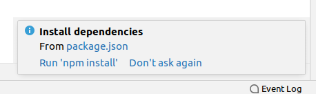

# XYBL_WEB

## 复现
1. 需求
    * IDEA或WebStorm： 安装方式略。
    * Node.js：
        * 安装教程：
        
          https://www.runoob.com/nodejs/nodejs-install-setup.html
        
        * 使用淘宝镜像cnpm（非必须）：
        
          https://blog.csdn.net/weixin_45650619/article/details/104188114
        
          > 注意文章评论。

2. 安装

   * 克隆代码至本地环境：

     ```shell
     git clone https://github.com/HeSheng09/XYBL_WEB.git
     ```

   * 使用IDEA或WebStorm打开项目

     * 正常情况下，IDE会提示是否导入依赖。提示如下，选择`npm install`。
     
       
     r
     * 如果没有提示，则打开IDE自带的terminal，运行`npm install`即可。

3. 测试

    ```http
    # 首页
    http://localhost:3000/
    # 登录，测试账户：user：张三，password：password
    http://localhost:3000/login/
    # 学生(有登录拦截)
    http://localhost:3000/student/
    ```

    若以上网页测试均功能正常，则表明安装成功。

      

## 目录结构说明

**XYBL_WEB**:  

* **bin**: 项目运行的入口，可在此修改项目运行端口（不建议）。
* **node_modules**: 项目依赖。github上clone的源码不包括这个部分，在运行 npm install 后自动构建。
*  **public**: 静态资源文件夹。在clone的源码中，可能不存在下列某个子文件夹（由于该子文件夹为空），如果需要，可以新建。
    *  **images**: 图片。
    *  **javascripts**: 页面相关的JavaScript代码。如JQuery等可以放在此处。
    *  **stylesheets**: 样式。
    *  **favicon.ico**: 图标。可以替换为其他图标（命名保持favicon.ico）。
* **routes**: 路由文件夹。其下的JavaScript代码负责控制页面跳转逻辑。
* **views**: 页面。其下的ejs文件为Express所用模板，其实质为html。
* **.gitignore**: git排除文件。个人编写代码时的测试文件，请添加至此，以保证项目整洁。
* **app.js**: 主体程序代码。其中主要为登录拦截逻辑。
* **package.json**: 项目依赖配置文件。
* **package-lock.json**: 项目依赖配置文件。
* **README.md**: 项目说明。
* **.asserts**: README.md图片保存路径。

## 其他参考资料：

1. 阿里巴巴矢量图标库： https://www.iconfont.cn/
2. Node.js Express 框架： https://www.runoob.com/nodejs/nodejs-express-framework.html
3. typora： https://www.typora.io/